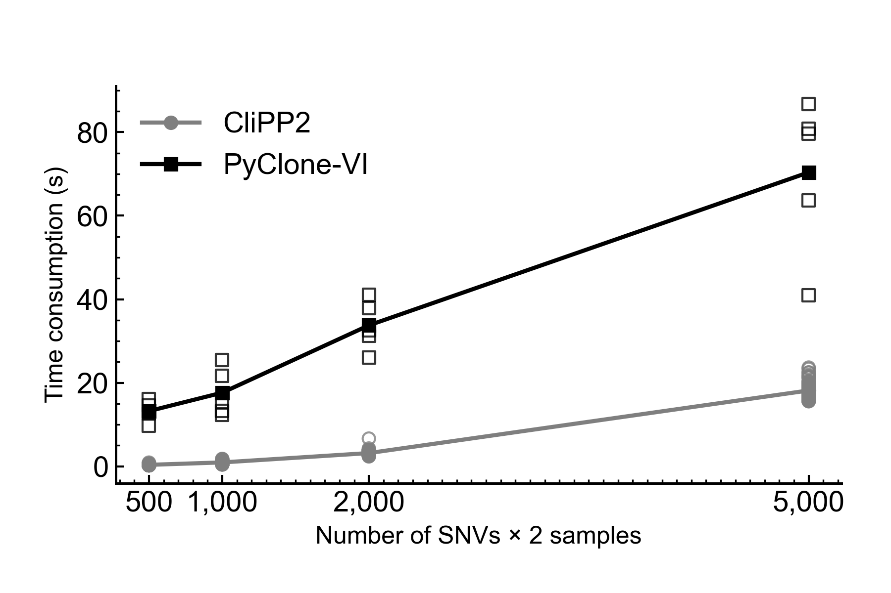

# SCAD-Penalized ADMM for Multi-region subclonal Reconstruction

This project implements a **CUDA-accelerated**, research-oriented pipeline to perform **SCAD-penalized ADMM** for subclonal reconstruction. It supports both single-sample(M=1) and multi-sample(M>1) scenarios. The newest version removes the need to build large dense matrices on CPU, instead using **iterative Conjugate Gradient** (CG) on the GPU to solve the ADMM subproblems efficiently, relying on **vectorized** or **sparse** operations in PyTorch. See [CliPP2.pdf](/CliPP2.pdf) and [gpu_implementation.pdf](/gpu_implementation.pdf) for details.

## Table of Contents
1. [Introduction](#introduction)  
2. [Directory Layout](#directory-layout)  
3. [Dependencies](#dependencies)  
4. [Running the Code](#running-the-code)  
5. [Script Overview](#script-overview)  
6. [Contact](#contact)

---

## Introduction

**Goal:**  
subclonal reconstruction by grouping single nucleotide variants (SNVs) that share similar frequency patterns, in either a single-sample or multi-sample context. The penalty is a group-SCAD that encourages merging of pairwise differences in logistic-scale parameters.

**Key Changes in the CUDA Implementation:**
1. **GPU (CUDA) Acceleration**:  
   We now rely on **PyTorch** tensors on the GPU. Instead of building a dense \(\mathbf{H}\) matrix \((B^T B + \alpha \Delta^T \Delta)\), we keep \(\Delta\) in **sparse** format and use **iterative Conjugate Gradient**.  

2. **No Python `for` Loops in the Main Numeric Code**:  
   - Pairwise differences are computed via sparse multiplication instead of explicit loops.  
   - The ADMM iteration is controlled by a `while True:` block, which is typically acceptable.

3. **Better Memory Usage for Large Problems**:  
   Because we never build or factor a large dense \(\mathbf{H}\), the approach scales more easily to large \(\text{No\_mutation} \times M\).

---

## Directory Layout

```
MUITI_REGION_CLIPP/
  ├── clipp2/
  │   ├── core.py/
  │   ├── core_cuda.py/
  │   ├── preprocess.py/
  │   └── ...
  ├── input_files/
  │   ├── regionA/
  │   │    ├── r.txt
  │   │    ├── n.txt
  │   │    ├── minor.txt
  │   │    ├── total.txt
  │   │    ├── purity_ploidy.txt
  │   │    ├── coef.txt
  │   └── regionB/ 
  │        └── ...
  ├── preprocess_result/
  ├── README.md
  └── ...
```

- **`input_files/`**: Example or raw input data with one subdirectory per region (`regionA`, `regionB`, etc.).  
- **`preprocess_result/`**: (Optional) where you might store processed data.  
- **`README.md`**: This documentation file, which you are reading now.

---

## Dependencies

- **Python 3.7+**
- **NumPy**  
- **SciPy**  
- **PyTorch (>=1.10)** or ideally **PyTorch 2.0+** for advanced CUDA/sparse ops
  - If you want to use the **built-in** `torch.sparse.linalg.cg`, you need **PyTorch ≥2.0** (experimental).
  - Otherwise, a **manual CG** loop is provided.

Install example:
```bash
pip install numpy scipy torch
```
(Adjust for your CUDA toolkit version if needed.)

---

## Running the Code

1. **Organize Data**  
   Each “region” subdirectory has `r.txt, n.txt, minor.txt, total.txt, purity_ploidy.txt, coef.txt`. All regions must have the same number of SNVs (rows).

2. **Load and Prepare**  
   The function `group_all_regions_for_ADMM(root_dir)` reads from all subdirectories in `root_dir` and returns stacked arrays `(r, n, minor, total, purity_list, coef_list, wcut)`.

3. **Run the ADMM**  
   In your script or interactive session:

   ```python
   from clipp2.core_cuda_ import *

   root_dir = "input_files"
   r, n, minor, total, purity, coef_list, wcut, drop_rows = group_all_regions_for_ADMM(root_dir)

   # Optionally pick a GPU device
   result = clipp2(
       r, n, minor, total,
       purity,
       coef_list,
       wcut=wcut,
       alpha=0.8, gamma=3.7, rho=1.02, precision=0.01,
       Run_limit=1e4, control_large=5, Lambda=0.01,
       post_th=0.05, least_diff=0.01,
       device='cuda'    # GPU acceleration
   )

   print("Final subclonal logistic-scale means (phi):", result['phi'])
   print("Cluster assignments (label):", result['label'])
   ```

   - Set `device='cuda'` if you have a GPU and want to accelerate.  
   - The code now uses **vectorized** sparse operations to compute pairwise differences.  
   - The main linear system `(B^T B + alpha * Delta^T Delta) * w = \alpha Delta^T (\eta_old - \tau_old) - B^T A` is solved **iteratively** with a **manual Conjugate Gradient** approach, **no** Python `for` loops.

4. **Results**  
   - **`result['phi']`**: The final logistic-scale estimates (subclonal means) for each SNV in shape `(No_mutation, M)`.  
   - **`result['label']`**: The integer cluster labels for each SNV, indicating subclonal membership.

---

## Script Overview

Key functions in `scad_admm.py` (or `core3.py`):

1. **`group_all_regions_for_ADMM(root_dir)`**  
   - Recursively finds subdirectories in `root_dir`.  
   - Reads in `r.txt, n.txt, minor.txt, total.txt, purity_ploidy.txt, coef.txt`.  
   - Returns arrays stacked as `(No_mutation, M)` plus a global `wcut` array.

2. **`build_DELTA_multiM(No_mutation, M)`**  
   Creates a **sparse** operator \(\Delta\), so \(\Delta \cdot w\) yields all pairwise differences `(w_i - w_j)` for `(i<j)` across the M coordinates. We avoid explicit loops by building a COO structure.

3. **`clipp2(...)`**  
   - **ADMM** iterations:
     - IRLS expansions => build `A, B` => flatten => construct `(B^T B + alpha * Delta^T Delta)*w = linear`.
     - **Sparse Iterative Solve**: A custom Conjugate Gradient routine on GPU, using `matvec_H` to apply `diag(B^2) + alpha(Delta^T Delta)` with no dense factorization or Python for loops.
     - SCAD threshold => update `eta, tau`.
     - Check residual => repeat until convergence.
   - **Post-processing** merges small clusters or those with small 2-norm differences.

4. **No `for` loops** for pairwise expansions  
   All pair expansions are done with **tensor indexing** and **sparse ops**.

5. **Manual CG**  
   - The code shows how to do a “loop-free” approach or a minimal `while True:` approach for iterative solving.  
   - If you prefer the built-in `torch.sparse.linalg.cg` (PyTorch 2.0+), you can swap in that call.

---
## Time Consumption



## Contact

- **Author**: Yu Ding, Ph.D. / Wenyi Wang’s Lab / MD Anderson Cancer Center  
- **Date**: October 2024  
- **Email**: yding4@mdanderson.org, yding1995@gmail.com

For questions, bug reports, or contributions, please reach out or open an issue. Feel free to adapt this pipeline to your subclonal modeling or SCAD-penalized tasks!

